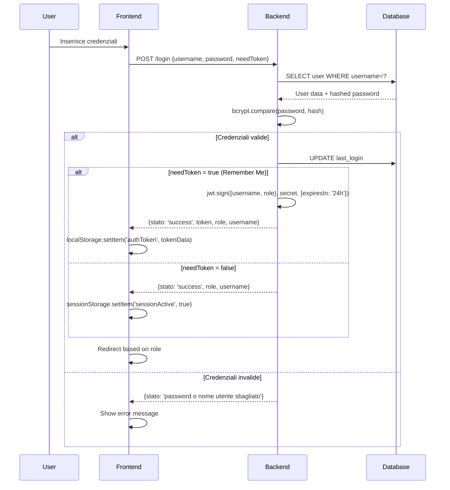
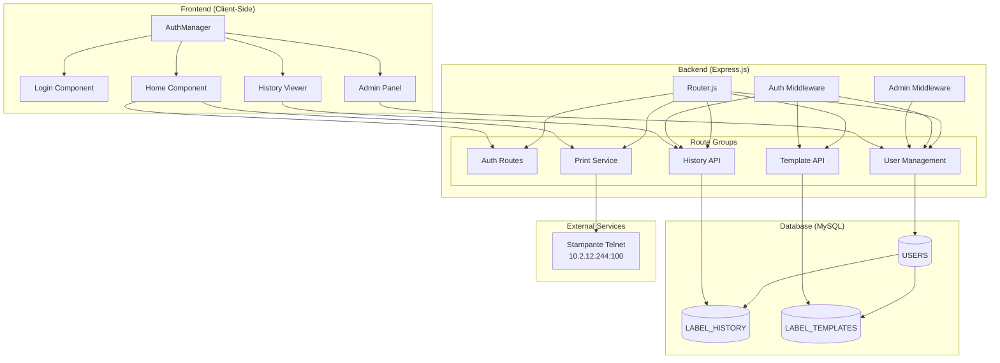

# Documentazione Sistema Gestione Stampante

## Indice
1. [Panoramica del Sistema](#panoramica-del-sistema)
2. [Architettura del Sistema](#architettura-del-sistema)
3. [Struttura Database](#struttura-database)
4. [Route Backend](#route-backend)
5. [Caricamento Dinamico Frontend](#caricamento-dinamico-frontend)
6. [Sistema di Autenticazione](#sistema-di-autenticazione)
7. [Configurazione Docker](#configurazione-docker)

---

## Panoramica del Sistema

Il sistema "Gestione Stampante" è un'applicazione web per la gestione e stampa di etichette con codici a barre 1D e 2D. Il sistema è composto da:

- **Backend Node.js** con Express
- **Frontend JavaScript vanilla** con architettura SPA
- **Database MySQL** per persistenza dati
- **Connessione Telnet** per comunicazione con stampante
- **Sistema di autenticazione** JWT/Session based

### Tecnologie Utilizzate
- **Runtime**: Node.js (ES Modules)
- **Framework Web**: Express.js 5.x
- **Database**: MySQL 5.7
- **Autenticazione**: JWT + bcrypt
- **Comunicazione Stampante**: Telnet Client
- **Frontend**: Vanilla JavaScript, CSS3, HTML5
- **Containerizzazione**: Docker + Docker Compose

---

## Architettura del Sistema

```
┌─────────────────┐    ┌──────────────────┐    ┌─────────────────┐
│   Frontend      │    │     Backend      │    │    Database     │
│   (Vanilla JS)  │◄──►│   (Express.js)   │◄──►│    (MySQL)      │
│                 │    │                  │    │                 │
│ • Home          │    │ • Authentication │    │ • USERS         │
│ • Admin         │    │ • User Management│    │ • LABEL_HISTORY │
│ • History       │    │ • Print Services │    │ • LABEL_TEMPLATES│
│ • Login         │    │ • History API    │    │                 │
└─────────────────┘    │ • Template API   │    └─────────────────┘
                       └──────────────────┘
                                │
                       ┌──────────────────┐
                       │    Stampante     │
                       │    (Telnet)      │
                       │                  │
                       │ • 10.2.12.244:100│
                       └──────────────────┘
```

---

## Struttura Database

Il database `stampante` contiene tre tabelle principali:

### 1. Tabella USERS
Gestisce gli utenti del sistema con autenticazione e controllo ruoli.

```sql
CREATE TABLE USERS (
    id INT AUTO_INCREMENT PRIMARY KEY,
    username VARCHAR(50) NOT NULL UNIQUE,
    password VARCHAR(255) NOT NULL,          -- Hash bcrypt
    role ENUM('user', 'admin') NOT NULL DEFAULT 'user',
    created_at TIMESTAMP DEFAULT CURRENT_TIMESTAMP,
    last_login TIMESTAMP NULL,
    
    -- Indici per prestazioni
    INDEX idx_username (username),
    INDEX idx_role (role),
    INDEX idx_created_at (created_at),
    INDEX idx_last_login (last_login)
) ENGINE=InnoDB DEFAULT CHARSET=utf8mb4 COLLATE=utf8mb4_unicode_ci;
```

**Utenti di Default:**
- `admin` / `admin123` (role: admin)
- `operatore` / `test123` (role: user)

### 2. Tabella LABEL_HISTORY
Traccia tutte le etichette stampate con metadati completi.

```sql
CREATE TABLE LABEL_HISTORY (
    id INT AUTO_INCREMENT PRIMARY KEY,
    user_id INT NOT NULL,
    username VARCHAR(50) NOT NULL,           -- Denormalizzato per performance
    label_type VARCHAR(100) NOT NULL,        -- Tipo etichetta (es. "Codice QR")
    label_data TEXT NOT NULL,               -- Dati stampati nell'etichetta
    command_generated TEXT NOT NULL,        -- Comando generato per stampante
    template_data JSON,                     -- Dati template utilizzati
    created_at TIMESTAMP DEFAULT CURRENT_TIMESTAMP,
    printed_at TIMESTAMP DEFAULT CURRENT_TIMESTAMP,
    status ENUM('success', 'failed', 'pending') DEFAULT 'success',
    notes TEXT,                            -- Note aggiuntive o errori
    
    -- Indici per queries frequenti
    INDEX idx_user_id (user_id),
    INDEX idx_username (username),
    INDEX idx_label_type (label_type),
    INDEX idx_created_at (created_at),
    INDEX idx_status (status),
    
    -- Relazione con tabella utenti
    FOREIGN KEY (user_id) REFERENCES USERS(id) ON DELETE CASCADE
) ENGINE=InnoDB DEFAULT CHARSET=utf8mb4 COLLATE=utf8mb4_unicode_ci;
```

### 3. Tabella LABEL_TEMPLATES
Gestisce i template salvabili e riutilizzabili per le etichette.

```sql
CREATE TABLE LABEL_TEMPLATES (
    id INT AUTO_INCREMENT PRIMARY KEY,
    name VARCHAR(200) NOT NULL,             -- Nome template
    description TEXT,                       -- Descrizione opzionale
    template_type VARCHAR(100) NOT NULL,    -- Tipo template (QR, Barcode, etc.)
    template_data JSON NOT NULL,           -- Configurazione template
    command_template TEXT NOT NULL,        -- Template comando stampante
    created_by INT NOT NULL,              -- ID utente creatore
    created_by_username VARCHAR(50) NOT NULL,
    created_at TIMESTAMP DEFAULT CURRENT_TIMESTAMP,
    updated_at TIMESTAMP DEFAULT CURRENT_TIMESTAMP ON UPDATE CURRENT_TIMESTAMP,
    is_public BOOLEAN DEFAULT FALSE,       -- Template pubblico/privato
    usage_count INT DEFAULT 0,           -- Contatore utilizzi
    
    -- Indici per ricerche
    INDEX idx_name (name),
    INDEX idx_template_type (template_type),
    INDEX idx_created_by (created_by),
    INDEX idx_created_at (created_at),
    INDEX idx_is_public (is_public),
    
    -- Relazione con tabella utenti
    FOREIGN KEY (created_by) REFERENCES USERS(id) ON DELETE CASCADE
) ENGINE=InnoDB DEFAULT CHARSET=utf8mb4 COLLATE=utf8mb4_unicode_ci;
```

**Template Predefiniti:**
```json
{
  "Template QR Base": {
    "template_type": "QR_CODE",
    "template_data": {
      "type": "QR",
      "size": {"width": 50, "height": 50},
      "position": {"x": 10, "y": 10},
      "options": {"error_correction": "M"}
    }
  }
}
```

---

## Route Backend

Il backend è strutturato in `Router.js` con le seguenti categorie di endpoint:

### Configurazione Base
```javascript
const app = express();
app.use(express.json());
app.use(express.urlencoded({ extended: true }));

// Logging middleware
app.use((req, res, next) => {
  console.log(`[REQUEST] ${req.method} ${req.path} from ${req.ip}`);
  next();
});
```

### Route Statiche
```javascript
// Serve frontend files
app.use("/App", express.static(path.join(__dirname, "Frontend")));
app.use("/Media", express.static(path.join(__dirname, "Media")));

// Serve commands configuration
app.get("/commands.json", (req, res) => {
  res.sendFile(path.join(__dirname, "commands.json"));
});

// Root redirect
app.get("/", (req, res) => {
  res.redirect("/App/home/home.html");
});
```

### 1. Autenticazione Routes

#### POST /login
Gestisce l'autenticazione degli utenti con supporto per token persistenti.

```javascript
app.post("/login", async (req, res) => {
  const { username, password, needToken } = req.body;
  
  // Validazione input
  if (!username || !password) {
    return res.status(400).json({ error: "Username e password richiesti" });
  }
  
  // Verifica credenziali
  const user = await checkUser(username, password);
  if (!user) {
    return res.json({
      stato: "password o nome utente sbagliato",
      token: null
    });
  }
  
  // Aggiorna ultimo login
  await db.promise().execute(
    "UPDATE USERS SET last_login = NOW() WHERE username = ?", 
    [username]
  );
  
  const responseData = {
    stato: "login succesfull",
    role: user.role,
    username: user.username
  };
  
  // Genera token se richiesto (remember me)
  if (needToken) {
    responseData.token = generateToken(username, user.role);
  }
  
  return res.status(200).json(responseData);
});
```

#### POST /api/verify-token
Verifica validità token JWT.

```javascript
app.post("/api/verify-token", authenticateToken, (req, res) => {
  res.json({ valid: true, user: req.user });
});
```

### 2. User Management Routes (Admin Only)

#### GET /api/users
Recupera lista utenti (solo admin).

```javascript
app.get("/api/users", authenticateToken, requireAdmin, async (req, res) => {
  const [rows] = await db.promise().execute(
    "SELECT id, username, role, created_at, last_login FROM USERS ORDER BY created_at DESC"
  );
  res.json({ users: rows });
});
```

#### POST /api/users
Crea nuovo utente (solo admin).

```javascript
app.post("/api/users", authenticateToken, requireAdmin, async (req, res) => {
  const { username, password, role } = req.body;
  
  // Validazione
  if (!username || !password || !role) {
    return res.status(400).json({ error: "Username, password e ruolo richiesti" });
  }
  
  if (!['user', 'admin'].includes(role)) {
    return res.status(400).json({ error: "Ruolo non valido" });
  }
  
  // Check duplicati
  const [existing] = await db.promise().execute(
    "SELECT id FROM USERS WHERE username = ?", [username]
  );
  
  if (existing.length > 0) {
    return res.status(409).json({ error: "Username già esistente" });
  }
  
  // Hash password e insert
  const hash = await bcrypt.hash(password, 10);
  const [result] = await db.promise().execute(
    "INSERT INTO USERS (username, password, role, created_at) VALUES (?, ?, ?, NOW())",
    [username, hash, role]
  );
  
  res.status(201).json({ message: "Utente creato", id: result.insertId });
});
```

#### PUT /api/users/:id
Aggiorna utente esistente.

#### DELETE /api/users/:id
Elimina utente (con protezione auto-eliminazione).

### 3. Print Service Routes

#### POST /print
Endpoint principale per stampa etichette.

```javascript
app.post("/print", async (req, res) => {
  const { cmd, label_type, label_data, template_data } = req.body;
  
  let printStatus = 'success';
  let errorMessage = null;
  
  // Configurazione Telnet
  const tn = new Telnet();
  
  tn.on("connect", function () {
    tn.write(`${cmd}\r\n`);
    setTimeout(() => {
      tn.write("P\r\n");  // Comando stampa
    }, 200);
  });
  
  try {
    // Connessione stampante via Telnet
    await tn.connect({
      host: env.TN_HOST,      // 10.2.12.244
      port: env.TN_PORT,      // 100
    });
    console.log("[PRINT] Stampa completata");
  } catch (err) {
    printStatus = 'failed';
    errorMessage = err.message;
  }
  
  // Salvataggio nello storico (se autenticato)
  const authHeader = req.headers['authorization'];
  if (authHeader && label_type && label_data) {
    const token = authHeader.split(' ')[1];
    const decoded = jwt.verify(token, env.TOKEN_SECRET);
    
    // Get user ID e salva history
    const [userResult] = await db.promise().execute(
      "SELECT id FROM USERS WHERE username = ?", [decoded.username]
    );
    
    if (userResult.length > 0) {
      await db.promise().execute(
        `INSERT INTO LABEL_HISTORY 
         (user_id, username, label_type, label_data, command_generated, template_data, status, notes) 
         VALUES (?, ?, ?, ?, ?, ?, ?, ?)`,
        [userResult[0].id, decoded.username, label_type, label_data, 
         cmd, JSON.stringify(template_data || {}), printStatus, errorMessage]
      );
    }
  }
  
  return printStatus === 'success' ? res.sendStatus(200) : res.status(500).json({
    error: "Errore di stampa",
    details: errorMessage
  });
});
```

### 4. History Management Routes

#### GET /api/history
Recupera storico etichette con paginazione e filtri.

```javascript
app.get("/api/history", authenticateToken, async (req, res) => {
  const { page = 1, limit = 20, type } = req.query;
  const offset = (page - 1) * limit;
  
  let query = `SELECT * FROM LABEL_HISTORY 
               WHERE user_id = (SELECT id FROM USERS WHERE username = ?)`;
  let queryParams = [req.user.username];
  
  // Filtro per tipo
  if (type) {
    query += " AND label_type = ?";
    queryParams.push(type);
  }
  
  query += " ORDER BY created_at DESC LIMIT ? OFFSET ?";
  queryParams.push(parseInt(limit), parseInt(offset));
  
  const [rows] = await db.promise().execute(query, queryParams);
  
  // Count totale per paginazione
  let countQuery = `SELECT COUNT(*) as total FROM LABEL_HISTORY 
                   WHERE user_id = (SELECT id FROM USERS WHERE username = ?)`;
  let countParams = [req.user.username];
  
  if (type) {
    countQuery += " AND label_type = ?";
    countParams.push(type);
  }
  
  const [countResult] = await db.promise().execute(countQuery, countParams);
  
  res.json({
    history: rows,
    pagination: {
      page: parseInt(page),
      limit: parseInt(limit),
      total: countResult[0].total,
      pages: Math.ceil(countResult[0].total / limit)
    }
  });
});
```

#### POST /api/history
Aggiunge entry allo storico manualmente.

#### DELETE /api/history/:id
Elimina entry dallo storico (solo proprietario).

### 5. Template Management Routes

#### GET /api/templates
Recupera template disponibili (pubblici + privati utente).

```javascript
app.get("/api/templates", authenticateToken, async (req, res) => {
  const [rows] = await db.promise().execute(
    `SELECT * FROM LABEL_TEMPLATES 
     WHERE is_public = TRUE OR created_by_username = ? 
     ORDER BY is_public DESC, name ASC`,
    [req.user.username]
  );
  
  res.json({ templates: rows });
});
```

#### POST /api/templates
Crea nuovo template.

#### POST /api/templates/:id/use
Incrementa contatore utilizzi template.

#### GET /api/templates/:id/export
Esporta template in formato JSON.

#### DELETE /api/templates/:id
Elimina template (solo proprietario).

### Middleware di Sicurezza

#### authenticateToken
Verifica validità JWT token.

```javascript
function authenticateToken(req, res, next) {
  const authHeader = req.headers['authorization'];
  const token = authHeader && authHeader.split(' ')[1];
  
  if (!token) {
    return res.sendStatus(401);
  }
  
  jwt.verify(token, env.TOKEN_SECRET, (err, user) => {
    if (err) return res.sendStatus(403);
    req.user = user;
    next();
  });
}
```

#### requireAdmin
Verifica ruolo amministratore.

```javascript
function requireAdmin(req, res, next) {
  if (req.user && req.user.role === 'admin') {
    next();
  } else {
    res.status(403).json({ 
      error: 'Accesso negato. Privilegi di amministratore richiesti.' 
    });
  }
}
```

---

## Caricamento Dinamico Frontend

Il frontend utilizza un'architettura modulare con caricamento dinamico dei componenti.

### Struttura Frontend
```
Frontend/
├── auth.js                 # AuthManager globale
├── style.css              # CSS globale
├── home/
│   ├── home.html          # Dashboard principale
│   └── home.js            # Logica generazione etichette
├── admin/
│   ├── admin.html         # Pannello amministratore
│   └── admin.js           # Gestione utenti
├── history/
│   ├── history.html       # Storico etichette
│   └── history.js         # Visualizzazione/filtri
└── login/
    ├── login.html         # Pagina login
    └── login.js           # Autenticazione
```

### AuthManager - Sistema di Autenticazione Frontend

```javascript path=C:\Users\hp\Documenti\filippo\Lavoro\cbl\Gestione Stampante\Frontend\auth.js start=1
class AuthManager {
  constructor() {
    this.tokenKey = 'authToken';
  }
  
  // Recupera dati autenticazione da localStorage/sessionStorage
  getAuthData() {
    const tokenData = localStorage.getItem(this.tokenKey);
    const sessionData = {
      active: sessionStorage.getItem('sessionActive') === 'true',
      username: sessionStorage.getItem('username'),
      role: sessionStorage.getItem('role')
    };
    
    // Priorità: token persistente > sessione temporanea
    if (tokenData) {
      try {
        const parsed = JSON.parse(tokenData);
        if (this.isValidToken(parsed)) {
          return {
            isAuthenticated: true,
            token: parsed.token,
            username: parsed.username,
            role: parsed.role,
            persistent: true
          };
        } else {
          localStorage.removeItem(this.tokenKey);
        }
      } catch (e) {
        localStorage.removeItem(this.tokenKey);
      }
    }
    
    if (sessionData.active) {
      return {
        isAuthenticated: true,
        username: sessionData.username,
        role: sessionData.role,
        persistent: false
      };
    }
    
    return { isAuthenticated: false };
  }
  
  // Richieste HTTP autenticate
  async makeAuthenticatedRequest(url, options = {}) {
    const authData = this.getAuthData();
    
    if (!authData.isAuthenticated) {
      throw new Error('Non autenticato');
    }
    
    const headers = {
      'Content-Type': 'application/json',
      ...options.headers
    };
    
    // Aggiunge header Authorization se presente token
    if (authData.token) {
      headers['Authorization'] = `Bearer ${authData.token}`;
    }
    
    const response = await fetch(url, {
      ...options,
      headers
    });
    
    // Handle token expiry
    if (response.status === 401 || response.status === 403) {
      this.logout();
      window.location.href = '/App/login/login.html';
      throw new Error('Token scaduto');
    }
    
    return response;
  }
  
  // Controllo accesso con redirect automatico
  requireAuth(requiredRole = null) {
    const authData = this.getAuthData();
    
    if (!authData.isAuthenticated) {
      window.location.href = '/App/login/login.html';
      return false;
    }
    
    if (requiredRole && authData.role !== requiredRole) {
      if (requiredRole === 'admin' && authData.role !== 'admin') {
        window.location.href = '/App/home/home.html';
        return false;
      }
    }
    
    return true;
  }
}

// Istanza globale
const authManager = new AuthManager();
```

### Sistema di Routing Client-Side

#### Login Component
```javascript path=C:\Users\hp\Documenti\filippo\Lavoro\cbl\Gestione Stampante\Frontend\login\login.js start=19
// Controllo token esistente al caricamento
async function checkExistingToken() {
  const token = getStoredToken();
  if (token && isValidToken(token)) {
    // Redirect automatico se già autenticato
    window.location.href = '/App/home/home.html';
  }
}

async function login() {
  const response = await fetch("/login", {
    method: "POST",
    headers: { 'Content-Type': 'application/json' },
    body: JSON.stringify({
      username: username,
      password: password,
      needToken: rememberMe,  // Richiedi token persistente
    }),
  });
  
  const data = await response.json();
  
  if (response.ok && data.stato === 'login succesfull') {
    if (rememberMe && data.token) {
      // Token persistente in localStorage
      saveToken(data.token, data.role, data.username);
    } else {
      // Sessione temporanea
      sessionStorage.setItem('sessionActive', 'true');
      sessionStorage.setItem('username', username);
      sessionStorage.setItem('role', data.role);
    }
    
    // Redirect basato su ruolo
    if (data.role === 'admin') {
      window.location.href = '/App/admin/admin.html';
    } else {
      window.location.href = '/App/home/home.html';
    }
  }
}
```

### Home Component - Generazione Dinamica Etichette

#### Caricamento Configurazione Comandi
```javascript path=C:\Users\hp\Documenti\filippo\Lavoro\cbl\Gestione Stampante\Frontend\home\home.js start=12
// Fetch configurazione comandi dal backend
async function getComandi() {
  const response = await fetch("/commands.json", { method: "GET" });
  return await response.json();
}

// Inizializzazione dinamica componenti
async function init() {
  const comandi = await getComandi();
  
  // Popola select tipo etichetta
  comandi.forEach((comando) => {
    const opt = document.createElement("option");
    opt.value = comando.command;
    opt.text = comando.type;
    typeSelect.appendChild(opt);
  });
  
  // Carica primo comando di default
  if (comandi.length > 0) {
    typeSelect.value = comandi[0].command;
    LoadSelection(comandi[0]);
  }
  
  // Event listener per cambio tipo
  typeSelect.addEventListener("change", (e) => {
    const choice = e.target.value;
    const selezionato = comandi.find((c) => c.command === choice);
    if (selezionato) LoadSelection(selezionato);
  });
}
```

#### Generazione Dinamica Form
```javascript path=C:\Users\hp\Documenti\filippo\Lavoro\cbl\Gestione Stampante\Frontend\home\home.js start=262
function LoadSelection(cmd) {
  const contenitore = document.getElementsByClassName("empty-div")[0];
  svuotaNodo(contenitore);
  
  // Memorizza comando corrente
  currentCmd = cmd;
  
  // Crea sezioni opzioni base/avanzate
  const sezioni = getOrCreateSezioniOpzioni(contenitore);
  
  // Array per gestione opzioni esclusive (codici 2D)
  const aggiornatriciEsclusive = [];
  let select2DTipo = null;
  
  // Genera controlli per ogni opzione
  cmd.options.forEach((option) => {
    switch (option.type) {
      case "value":
        const { label, input } = creaCampoNumero(option);
        inserisciInSezione(sezioni, !!option.advanced, label, input);
        break;
        
      case "select":
        const { label: selectLabel, select } = creaCampoSelect(option);
        inserisciInSezione(sezioni, !!option.advanced, selectLabel, select);
        
        // Rileva select tipo 2D per opzioni esclusive
        const is2DType = (option.description || "").toLowerCase()
          .includes("2d barcode type");
        if (is2DType) {
          select2DTipo = select;
        }
        break;
        
      case "range":
        const { label: rangeLabel, input: rangeInput, output } = creaCampoRange(option);
        inserisciInSezione(sezioni, !!option.advanced, rangeLabel, rangeInput, [output]);
        break;
    }
    
    // Gestione opzioni esclusive per codici 2D
    if (Array.isArray(option.esclusive_options)) {
      const exclusiveUpdater = (selectedName) => {
        // Genera controlli specifici per tipo 2D selezionato
        const match = option.esclusive_options.find(
          (ex) => String(ex.for).toLowerCase() === String(selectedName).toLowerCase()
        );
        
        if (match) {
          // Crea controllo dinamico basato su configurazione
          if (match.type === "range") {
            // Genera range slider
          } else if (match.type === "select") {
            // Genera select con opzioni
          }
        }
      };
      
      aggiornatriciEsclusive.push(exclusiveUpdater);
    }
  });
  
  // Collega aggiornamento opzioni esclusive al cambio tipo 2D
  if (select2DTipo && aggiornatriciEsclusive.length > 0) {
    select2DTipo.addEventListener("change", () => {
      const selectedName = select2DTipo.options[select2DTipo.selectedIndex].textContent;
      aggiornatriciEsclusive.forEach((fn) => fn(selectedName));
    });
  }
}
```

### Admin Component - Gestione Utenti

#### Caricamento Dinamico Lista Utenti
```javascript path=C:\Users\hp\Documenti\filippo\Lavoro\cbl\Gestione Stampante\Frontend\admin\admin.js start=60
async function loadUsers() {
  try {
    const response = await authManager.makeAuthenticatedRequest('/api/users');
    const data = await response.json();
    
    if (response.ok) {
      users = data.users;
      renderUsersTable();
    } else {
      showNotification('Errore caricamento utenti: ' + data.error, 'error');
    }
  } catch (error) {
    showNotification('Errore di connessione', 'error');
  }
}

function renderUsersTable() {
  const tbody = document.querySelector('.data-table tbody');
  tbody.innerHTML = '';
  
  users.forEach(user => {
    const row = createUserRow(user);
    tbody.appendChild(row);
  });
}

function createUserRow(user) {
  const row = document.createElement('tr');
  const roleDisplay = user.role === 'admin' ? 'Amministratore' : 'Operatore';
  const lastLogin = user.last_login ? 
    new Date(user.last_login).toLocaleString('it-IT') : 'Mai';
  
  row.innerHTML = `
    <td>${escapeHtml(user.username)}</td>
    <td>${roleDisplay}</td>
    <td>${lastLogin}</td>
    <td>
      <button class="button button-icon" onclick="editUser(${user.id})">
        <i class="fa-solid fa-pen"></i>
      </button>
      <button class="button button-icon" onclick="deleteUser(${user.id})">
        <i class="fa-solid fa-trash-alt"></i>
      </button>
    </td>
  `;
  
  return row;
}
```

#### Modal Dinamico per Editing
```javascript path=C:\Users\hp\Documenti\filippo\Lavoro\cbl\Gestione Stampante\Frontend\admin\admin.js start=143
function showUserModal(title, username = '', password = '', role = 'user') {
  // Rimuove modal esistente
  const existingModal = document.getElementById('userModal');
  if (existingModal) {
    existingModal.remove();
  }
  
  // Crea modal dinamicamente
  const modal = document.createElement('div');
  modal.id = 'userModal';
  modal.className = 'modal';
  modal.innerHTML = `
    <div class="modal-content">
      <div class="modal-header">
        <h3>${title}</h3>
        <button type="button" class="modal-close" onclick="closeUserModal()">&times;</button>
      </div>
      <div class="modal-body">
        <form id="userForm">
          <div class="form-group">
            <label for="modalUsername">Username</label>
            <input type="text" id="modalUsername" value="${escapeHtml(username)}" required>
          </div>
          <div class="form-group">
            <label for="modalPassword">
              Password ${editingUserId ? '(lascia vuoto per non modificare)' : ''}
            </label>
            <input type="password" id="modalPassword" ${editingUserId ? '' : 'required'}>
          </div>
          <div class="form-group">
            <label for="modalRole">Ruolo</label>
            <select id="modalRole" required>
              <option value="user" ${role === 'user' ? 'selected' : ''}>Operatore</option>
              <option value="admin" ${role === 'admin' ? 'selected' : ''}>Amministratore</option>
            </select>
          </div>
        </form>
      </div>
      <div class="modal-footer">
        <button type="button" onclick="closeUserModal()">Annulla</button>
        <button type="button" onclick="saveUser()">${editingUserId ? 'Salva' : 'Crea'}</button>
      </div>
    </div>
  `;
  
  document.body.appendChild(modal);
  modal.style.display = 'flex';
  
  // Auto-focus
  setTimeout(() => {
    document.getElementById('modalUsername').focus();
  }, 100);
}
```

### History Component - Visualizzazione Storico

#### Caricamento Paginato con Filtri
```javascript path=C:\Users\hp\Documenti\filippo\Lavoro\cbl\Gestione Stampante\Frontend\history\history.js start=69
async function loadHistory() {
  try {
    showLoadingState();
    const response = await authManager.makeAuthenticatedRequest('/api/history?limit=100');
    const data = await response.json();
    
    if (response.ok) {
      history = data.history || [];
      filteredHistory = [...history];
      updateStats();
      updateTypeFilter();
      renderHistory();
    } else {
      showNotification('Errore caricamento storico: ' + data.error, 'error');
    }
  } catch (error) {
    showNotification('Errore di connessione', 'error');
  } finally {
    hideLoadingState();
  }
}

function filterHistory() {
  const searchTerm = document.getElementById('search-input').value.toLowerCase();
  const typeFilter = document.getElementById('type-filter').value;
  const statusFilter = document.getElementById('status-filter').value;
  
  filteredHistory = history.filter(item => {
    const matchesSearch = !searchTerm || 
      item.label_type.toLowerCase().includes(searchTerm) ||
      item.label_data.toLowerCase().includes(searchTerm);
    
    const matchesType = !typeFilter || item.label_type === typeFilter;
    const matchesStatus = !statusFilter || item.status === statusFilter;
    
    return matchesSearch && matchesType && matchesStatus;
  });
  
  currentPage = 1;
  renderHistory();
}
```

#### Rendering Dinamico Tabella
```javascript path=C:\Users\hp\Documenti\filippo\Lavoro\cbl\Gestione Stampante\Frontend\history\history.js start=190
function createHistoryRow(item) {
  const row = document.createElement('tr');
  row.className = 'history-row';
  row.dataset.id = item.id;
  
  const formatDate = (dateString) => {
    return new Date(dateString).toLocaleString('it-IT', {
      day: '2-digit', month: '2-digit', year: 'numeric',
      hour: '2-digit', minute: '2-digit'
    });
  };
  
  const getStatusBadge = (status) => {
    const badges = {
      'success': '<span class="status-badge success"><i class="fa-solid fa-check-circle"></i> Riuscita</span>',
      'failed': '<span class="status-badge error"><i class="fa-solid fa-times-circle"></i> Fallita</span>',
      'pending': '<span class="status-badge warning"><i class="fa-solid fa-clock"></i> In attesa</span>'
    };
    return badges[status] || '<span class="status-badge">Sconosciuto</span>';
  };
  
  row.innerHTML = `
    <td>${formatDate(item.printed_at)}</td>
    <td>${escapeHtml(item.label_type)}</td>
    <td title="${escapeHtml(item.label_data)}">${escapeHtml(truncateText(item.label_data))}</td>
    <td>${getStatusBadge(item.status)}</td>
    <td>
      <button class="button button-icon view-btn" title="Visualizza dettagli">
        <i class="fa-solid fa-eye"></i>
      </button>
      <button class="button button-icon delete-btn" title="Elimina">
        <i class="fa-solid fa-trash-alt"></i>
      </button>
    </td>
  `;
  
  // Event listeners dinamici
  row.querySelector('.view-btn').addEventListener('click', () => selectItem(item));
  row.querySelector('.delete-btn').addEventListener('click', () => deleteHistoryItem(item.id));
  
  // Row selezionabile
  row.addEventListener('click', (e) => {
    if (!e.target.closest('button')) {
      selectItem(item);
    }
  });
  
  return row;
}
```

### Sistema di Notifiche Globale
```javascript
function showNotification(message, type = 'info') {
  // Rimuove notifica esistente
  const existingNotification = document.getElementById('notification');
  if (existingNotification) {
    existingNotification.remove();
  }
  
  const notification = document.createElement('div');
  notification.id = 'notification';
  notification.className = `notification notification-${type}`;
  notification.textContent = message;
  
  document.body.appendChild(notification);
  
  // Auto-remove dopo 5 secondi
  setTimeout(() => {
    if (notification && notification.parentNode) {
      notification.parentNode.removeChild(notification);
    }
  }, 5000);
}
```

---

## Sistema di Autenticazione

### Flusso di Autenticazione



### JWT Token Structure
```json
{
  "header": {
    "alg": "HS256",
    "typ": "JWT"
  },
  "payload": {
    "username": "admin",
    "role": "admin",
    "iat": 1642680000,
    "exp": 1642766400
  },
  "signature": "HMACSHA256(base64UrlEncode(header) + '.' + base64UrlEncode(payload), SECRET_KEY)"
}
```

### Storage Strategy
1. **Token Persistente (Remember Me)**: localStorage con scadenza 24h
2. **Sessione Temporanea**: sessionStorage fino alla chiusura browser
3. **Controlli di Sicurezza**: Verifica scadenza token, auto-logout

---

## Configurazione Docker

### docker-compose.yaml
```yaml
services:
  db:
    image: mysql:5.7
    restart: always
    environment:
      MYSQL_DATABASE: stampante
      MYSQL_ROOT_PASSWORD: password
    ports:
      - "3500:3306"
    volumes:
      - my-db:/var/lib/mysql
      - ./db/init:/docker-entrypoint-initdb.d    # Auto-init scripts

  app:
    build:
      context: .
      dockerfile: dockerfile
    restart: unless-stopped
    depends_on:
      - db
    environment:
      DB_HOST: db
      DB_USER: app
      DB_PASSWORD: password
      DB_NAME: stampante
      DB_PORT: 3306
      TOKEN_SECRET: e48446454f3093b2d0d72ca9fbf87c82e802fa5090a69de9de21544a81f1b3fac66165b4a036136ffaa9a8ac08d814b61cf46d35d01cfeb64ba4fcb8c708eebd
      TN_HOST: 10.2.12.244         # Indirizzo IP stampante
      TN_PORT: 100                 # Porta Telnet stampante
    ports:
      - "800:800"
    volumes:
      - .:/usr/src/app             # Live mount per sviluppo

volumes:
  my-db:
```

### Dockerfile
```dockerfile
FROM node:18-alpine
WORKDIR /usr/src/app
COPY package*.json ./
RUN npm ci --only=production
COPY . .
EXPOSE 800
CMD ["node", "Router.js"]
```

### Inizializzazione Database
Script eseguiti automaticamente al primo avvio:
1. `01-schema.sql` - Crea schema database e tabelle
2. `02-default-users.sql` - Inserisce utenti di default
3. `03-label-history.sql` - Crea tabelle storico e template

---

## Diagramma dei Componenti



## Performance e Sicurezza

### Ottimizzazioni Database
- **Indici strategici** su colonne frequently queried
- **Foreign keys** con CASCADE per integrità referenziale
- **JSON fields** per template_data flessibile
- **Paginazione** per large datasets

### Sicurezza
- **Password hashing** con bcrypt (salt rounds: 10)
- **JWT tokens** con scadenza 24h
- **Role-based access control** (RBAC)
- **Input validation** e **SQL injection** prevention
- **XSS protection** con HTML escaping

### Monitoraggio
- **Request logging** con timestamp e IP
- **Error handling** strutturato
- **Status tracking** per operazioni stampa
- **Usage metrics** per template

---

*Documentazione generata il: 17 settembre 2025*
*Versione Sistema: 1.0.0*