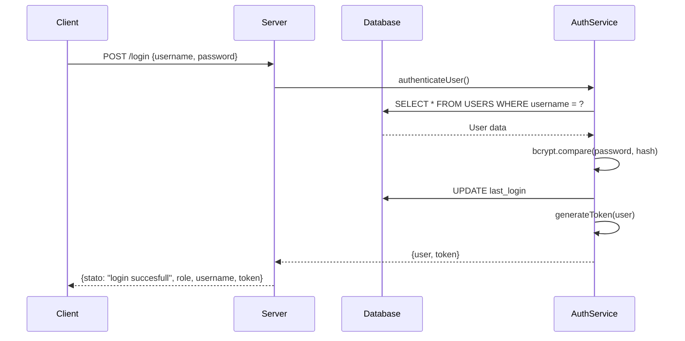

# 📋 Documentazione Tecnica Completa - Sistema Gestione Stampante

## Indice

- [Panoramica del Sistema](#panoramica-del-sistema)
- [Architettura Backend](#architettura-backend)
- [API Endpoints Dettagliati](#api-endpoints-dettagliati)
- [Servizi Backend](#servizi-backend)
- [Sistema di Autenticazione](#sistema-di-autenticazione)
- [Architettura Frontend](#architettura-frontend)
- [Componenti Frontend](#componenti-frontend)
- [Struttura Database](#struttura-database)
- [Sistema di Logging](#sistema-di-logging)
- [Configurazione e Deploy](#configurazione-e-deploy)
- [Comandi Stampante](#comandi-stampante)

---

## Panoramica del Sistema

Il **Sistema Gestione Stampante** è un'applicazione web per la generazione e stampa di etichette con codici a barre 1D e 2D. L'architettura è composta da:

- **Backend**: Node.js con Express.js e MySQL
- **Frontend**: Vanilla JavaScript con interfaccia responsive
- **Database**: MySQL 5.7+ con supporto JSON
- **Comunicazione Stampante**: Protocollo Telnet
- **Container**: Docker e Docker Compose

### Stack Tecnologico

```
Backend:
├── Node.js 18+ (ES Modules)
├── Express.js 5.x
├── MySQL2 (Database driver)
├── JWT (Autenticazione)
├── bcrypt (Password hashing)
└── Telnet-client (Comunicazione stampante)

Frontend:
├── Vanilla JavaScript ES6+
├── CSS3 con variabili custom
├── Font Awesome 6 (Icone)
└── Architettura SPA

Infrastructure:
├── Docker & Docker Compose
├── MySQL 5.7 container
└── Network isolation
```

---

## Architettura Backend

### Struttura dei File

```
src/
├── config/
│   ├── app.js           # Configurazione applicazione
│   └── database.js      # Gestione connessione database
├── middleware/
│   └── auth.js          # Middleware autenticazione
├── services/
│   ├── authService.js   # Servizio autenticazione
│   └── printerService.js # Servizio stampante
└── utils/
    ├── errors.js        # Gestione errori
    └── logger.js        # Sistema logging
```

### Router Principale (Router.js)

Il router principale gestisce l'inizializzazione completa dell'applicazione:

#### Classe Application

```javascript
class Application {
  constructor()              // Inizializza Express app
  async initialize()         // Setup completo applicazione
  setupMiddleware()          // Configurazione middleware
  setupRoutes()              // Configurazione route
  setupErrorHandling()       // Gestione errori globale
  async start()              // Avvio server
  async stop()               // Arresto server
  async shutdown()           // Shutdown graceful
}
```

#### Middleware Configurati

1. **Body Parsing**: JSON e URL-encoded (limite 10MB)
2. **Request Logging**: Log automatico di tutte le richieste
3. **Security Headers**: X-Content-Type-Options, X-Frame-Options, X-XSS-Protection
4. **Rate Limiting**: 100 richieste per 15 minuti per IP
5. **Static Files**: Serving dei file frontend

---

## API Endpoints Dettagliati

### Autenticazione

#### `POST /login`
Autentica un utente e genera token JWT.

**Request Body:**
```json
{
  "username": "string",
  "password": "string", 
  "needToken": "boolean" // Opzionale per "Remember Me"
}
```

**Response (Success):**
```json
{
  "stato": "login succesfull",
  "role": "admin|user",
  "username": "string",
  "token": "jwt_token" // Solo se needToken=true
}
```

**Response (Error):**
```json
{
  "stato": "error_message"
}
```

**Implementazione:**
- Valida credenziali con bcrypt
- Aggiorna timestamp `last_login`
- Genera JWT token se richiesto
- Log dell'operazione (successo/fallimento)

#### `POST /api/verify-token`
Verifica validità token JWT.

**Headers:**
```
Authorization: Bearer <jwt_token>
```

**Response:**
```json
{
  "valid": true,
  "user": {
    "username": "string",
    "role": "string",
    "id": "number"
  },
  "timestamp": "ISO_string"
}
```

### Gestione Utenti (Solo Admin)

#### `GET /api/users`
Recupera lista completa degli utenti.

**Headers:** `Authorization: Bearer <admin_token>`

**Response:**
```json
{
  "users": [
    {
      "id": 1,
      "username": "admin",
      "role": "admin",
      "created_at": "2023-01-01T12:00:00Z",
      "last_login": "2023-01-02T08:30:00Z"
    }
  ]
}
```

#### `POST /api/users`
Crea nuovo utente.

**Request Body:**
```json
{
  "username": "string",    // Min 3 caratteri, univoco
  "password": "string",    // Min 6 caratteri
  "role": "user|admin"     // Default: user
}
```

**Response:**
```json
{
  "message": "Utente creato con successo",
  "id": 123
}
```

**Validazioni:**
- Username univoco e ≥3 caratteri
- Password ≥6 caratteri (hashata con bcrypt)
- Role valido (user/admin)

#### `PUT /api/users/:id`
Aggiorna utente esistente.

**Request Body:** (campi opzionali)
```json
{
  "username": "string",
  "password": "string",
  "role": "user|admin"
}
```

**Permessi:**
- Admin: può modificare qualsiasi utente
- User: può modificare solo se stesso (no cambio role)

#### `DELETE /api/users/:id`
Elimina utente (solo admin).

**Restrizioni:**
- Solo admin può eliminare
- Non può eliminare se stesso
- Elimina anche storico associato (CASCADE)

### Gestione Storico

#### `GET /api/history`
Recupera storico stampe con paginazione.

**Query Parameters:**
```
?page=1&limit=20&type=QR_CODE
```

**Response:**
```json
{
  "history": [
    {
      "id": 1,
      "user_id": 2,
      "username": "operatore", 
      "label_type": "Codice QR",
      "label_data": "TEST123",
      "command_generated": "B2 10,10,Q,2,M,1,0",
      "template_data": "{}",
      "created_at": "2023-01-01T12:00:00Z",
      "printed_at": "2023-01-01T12:00:00Z",
      "status": "success",
      "notes": null
    }
  ],
  "pagination": {
    "page": 1,
    "limit": 20,
    "total": 150,
    "pages": 8
  }
}
```

#### `POST /api/history`
Aggiunge entry allo storico.

**Request Body:**
```json
{
  "label_type": "string",
  "label_data": "string", 
  "command_generated": "string",
  "template_data": "object",
  "status": "success|failed|pending",
  "notes": "string"
}
```

#### `DELETE /api/history/:id`
Elimina entry dallo storico (solo proprietario).

### Gestione Template

#### `GET /api/templates`
Recupera template accessibili all'utente.

**Response:**
```json
{
  "templates": [
    {
      "id": 1,
      "name": "Template QR Base",
      "description": "Template base per codici QR",
      "template_type": "QR_CODE",
      "template_data": "{}",
      "command_template": "B2{x},{y},Q,{model},{ecc}",
      "created_by": 1,
      "created_by_username": "admin",
      "is_public": true,
      "usage_count": 25
    }
  ]
}
```

**Logica di accesso:**
- Template pubblici: visibili a tutti
- Template privati: solo al creatore

#### `POST /api/templates`
Crea nuovo template.

**Request Body:**
```json
{
  "name": "string",
  "description": "string",
  "template_type": "string",
  "template_data": "object",
  "command_template": "string",
  "is_public": "boolean"
}
```

#### `POST /api/templates/:id/use`
Incrementa contatore utilizzo template.

#### `GET /api/templates/:id/export`
Esporta template come JSON scaricabile.

#### `DELETE /api/templates/:id`
Elimina template (solo creatore).

### Servizio Stampa

#### `POST /print`
Stampa etichetta via Telnet.

**Headers:** `Authorization: Bearer <token>` (opzionale)

**Request Body:**
```json
{
  "cmd": "B2 10,10,Q,2,M,1,0,'TEST123'",
  "label_type": "Codice QR",
  "label_data": "TEST123",
  "template_data": "{}",
  "quantity": 1
}
```

**Response:**
```json
{
  "success": true,
  "message": "Print job completed successfully",
  "duration": 1250
}
```

**Implementazione:**
1. Validazione comando stampa
2. Connessione Telnet alla stampante
3. Invio comando + comando print (P1,{quantity})
4. Salvataggio automatico nello storico (se autenticato)
5. Logging completo dell'operazione

### Utilità

#### `GET /health`
Health check completo del sistema.

**Response:**
```json
{
  "status": "ok",
  "timestamp": "2023-01-01T12:00:00Z",
  "version": "1.0.0",
  "database": {
    "status": "healthy",
    "timestamp": "2023-01-01T12:00:00Z"
  },
  "printer": {
    "host": "10.2.12.244",
    "port": 100,
    "connected": false
  }
}
```

#### `GET /printer/test`
Test connessione stampante (solo admin).

#### `GET /printer/status`
Status dettagliato stampante.

---

## Servizi Backend

### AuthService

Gestisce tutte le operazioni di autenticazione e autorizzazione.

#### Metodi Principali

```javascript
class AuthService {
  // Autenticazione
  async authenticateUser(username, password)
  generateToken(user)
  async verifyToken(token)

  // Gestione password
  async hashPassword(password)
  validatePasswordStrength(password)

  // Gestione utenti  
  async createUser(userData)
  async updateUser(userId, updateData, currentUser)
  async deleteUser(userId, currentUser)
  async findUserByUsername(username)
  async findUserById(userId)
  async getAllUsers()

  // Utilità
  async updateLastLogin(username)
  validateUsername(username)
}
```

#### Sicurezza Implementata

- **Password Hashing**: bcrypt con 10 salt rounds
- **JWT Tokens**: HS256 con scadenza 24h
- **Validazione Input**: Controlli rigidi su username/password
- **Logging Sicurezza**: Log di tutti gli eventi auth
- **Controlli Autorizzazione**: RBAC (Role-Based Access Control)

### PrinterService

Gestisce la comunicazione con la stampante via protocollo Telnet.

#### Metodi Principali

```javascript
class PrinterService {
  // Connessione
  createConnection()
  async connect(retryCount = 0)
  
  // Stampa
  async printLabel(labelData)
  async sendCommand(connection, command, quantity)
  
  // Utilità
  async testConnection()
  getPrinterStatus()
  validatePrintCommand(command)
  safeCommandString(command, maxLength = 100)
}
```

#### Configurazione Stampante

```javascript
const printerConfig = {
  host: '10.2.12.244',    // IP stampante
  port: 100,              // Porta Telnet 
  timeout: 30000,         // Timeout connessione
  retryAttempts: 3,       // Tentativi riconnessione
  retryDelay: 2000        // Delay tra tentativi
}
```

#### Flusso di Stampa

1. **Validazione Comando**: Verifica formato e sicurezza
2. **Connessione Telnet**: Con retry automatico
3. **Invio Comando**: Comando principale + delay 200ms
4. **Comando Print**: `P1,{quantity}` per avviare stampa
5. **Timeout Management**: 5 secondi per operazione
6. **Chiusura Connessione**: Cleanup automatico
7. **Logging**: Registrazione completa operazione

---

## Sistema di Autenticazione

### Flusso di Login



### Storage Token

#### LocalStorage (Persistent)
```javascript
const tokenData = {
  token: "jwt_string",
  role: "admin|user", 
  username: "string",
  timestamp: Date.now()
}
localStorage.setItem('authToken', JSON.stringify(tokenData))
```

#### SessionStorage (Temporaneo)
```javascript
sessionStorage.setItem('sessionActive', 'true')
sessionStorage.setItem('username', username)
sessionStorage.setItem('role', role)
```

### Middleware di Autenticazione

#### authenticateToken
Valida JWT token e popola `req.user`.

```javascript
export const authenticateToken = (req, res, next) => {
  const token = req.headers['authorization']?.split(' ')[1]
  
  if (!token) {
    return res.status(401).json({
      error: 'Access token required',
      code: 'MISSING_TOKEN'
    })
  }

  try {
    const decoded = jwt.verify(token, config.jwt.secret)
    req.user = decoded
    next()
  } catch (error) {
    // Gestione errori token scaduto/invalido
  }
}
```

#### requireAdmin / requireUser
Controlli autorizzazione basati su ruolo.

#### optionalAuth  
Autenticazione opzionale per endpoint misti.

#### rateLimit
Rate limiting con memoria in-memory.

### Gestione Scadenza Token

#### Frontend (auth.js)
```javascript
isValidToken(tokenData) {
  if (!tokenData?.timestamp) return false
  const twentyFourHours = 24 * 60 * 60 * 1000
  return (Date.now() - tokenData.timestamp) < twentyFourHours
}
```

#### Auto-redirect su token scaduto
```javascript
if (response.status === 401 || response.status === 403) {
  authManager.logout()
  window.location.href = '/App/login/login.html'
}
```

---

## Architettura Frontend

### Struttura File Frontend

```
Frontend/
├── auth.js              # AuthManager globale
├── style.css            # Stili globali
├── login/
│   ├── login.html       # Pagina login
│   └── login.js         # Logica login
├── home/
│   ├── home.html        # Dashboard principale
│   └── home.js          # Generazione etichette
├── admin/
│   ├── admin.html       # Pannello admin
│   └── admin.js         # Gestione utenti
└── history/
    ├── history.html     # Storico stampe
    └── history.js       # Visualizzazione storico
```

### AuthManager Globale

Classe singleton per gestione autenticazione client-side.

```javascript
class AuthManager {
  constructor() {
    this.tokenKey = 'authToken'
  }

  // Recupero dati autenticazione
  getAuthData()
  isValidToken(tokenData)
  
  // API calls autenticate
  async makeAuthenticatedRequest(url, options = {})
  
  // Controlli ruolo
  isAdmin()
  isUser()
  
  // Gestione sessione
  logout()
  requireAuth(requiredRole = null)
  getCurrentUsername()
  getCurrentRole()
}
```

### Pattern Architetturale

#### SPA (Single Page Application)
- Routing client-side tramite `window.location.href`
- Componenti modulari per ogni sezione
- State management locale per ogni modulo
- Comunicazione API centralizzata

#### Component Pattern
Ogni sezione è un modulo auto-contenuto:

```javascript
// Pattern base per ogni modulo
document.addEventListener('DOMContentLoaded', function() {
  // 1. Controllo autenticazione
  if (!authManager.requireAuth()) return
  
  // 2. Inizializzazione UI
  initializeUI()
  
  // 3. Setup event listeners
  setupEventListeners()
  
  // 4. Load dati iniziali
  loadInitialData()
})
```

---

## Componenti Frontend

### Login Component (login.js)

#### Funzioni Principali

```javascript
async function login() {
  // 1. Validazione input
  // 2. Chiamata API /login
  // 3. Storage token (localStorage/sessionStorage)
  // 4. Redirect basato su ruolo
}

function saveToken(token, role, username) {
  const tokenData = {
    token, role, username, 
    timestamp: Date.now()
  }
  localStorage.setItem('authToken', JSON.stringify(tokenData))
}

function checkExistingToken() {
  // Auto-redirect se token valido esiste
}
```

#### Gestione "Remember Me"

```javascript
const rememberMe = document.getElementById("remember_me")?.checked

if (rememberMe && data.token) {
  saveToken(data.token, data.role, data.username)
} else {
  // Session storage per login temporaneo
  sessionStorage.setItem('sessionActive', 'true')
  sessionStorage.setItem('username', username)
  sessionStorage.setItem('role', data.role)
}
```

### Home Component (home.js)

Componente più complesso per la generazione dinamica di etichette.

#### Gestione Dinamica Form

```javascript
let currentCmd = null  // Comando attualmente selezionato

async function init() {
  // 1. Caricamento configurazione comandi
  const comandi = await getComandi()
  
  // 2. Popolamento select tipo
  // 3. Setup event listeners
  // 4. Render primo comando
}

function LoadSelection(cmd) {
  // 1. Pulizia container precedente
  // 2. Generazione dinamica form basata su cmd.options
  // 3. Gestione opzioni esclusive per codici 2D
  // 4. Setup event handlers per interazione
}
```

#### Tipi di Controlli Supportati

1. **value**: Input numerico con limiti
2. **select**: Dropdown con opzioni predefinite  
3. **range**: Slider con output live
4. **file_upload**: Upload area drag&drop
5. **checkbox**: Checkbox custom stilizzati

#### Generazione Comando Stampa

```javascript
function buildCommandString() {
  if (!currentCmd) return ""
  
  const values = leggiValoriCampi()
  
  // 1. Validazione parametri obbligatori (p1, p2)
  // 2. Identificazione ultimo parametro con valore
  // 3. Costruzione stringa comando ottimizzata
  
  return currentCmd.command + values.join(",")
}
```

#### Gestione Opzioni Esclusive

Per codici 2D (PDF417, QR, DataMatrix):

```javascript
const aggiornatriciEsclusive = []  // Array di funzioni update

// Per ogni opzione esclusiva
if (hasExclusive) {
  exclusiveUpdater = (selectedName) => {
    // 1. Trova configurazione per tipo selezionato
    // 2. Genera controlli specifici
    // 3. Aggiorna DOM
  }
  aggiornatriciEsclusive.push(exclusiveUpdater)
}

// Quando cambia il tipo 2D
select2DTipo.addEventListener("change", () => {
  const selectedName = getSelected2DName()
  aggiornatriciEsclusive.forEach(fn => fn(selectedName))
})
```

### Admin Component (admin.js)

Pannello amministrazione per gestione utenti.

#### State Management

```javascript
let users = []           // Lista utenti caricati
let editingUserId = null // ID utente in modifica
```

#### Funzioni CRUD

```javascript
async function loadUsers() {
  const response = await authManager.makeAuthenticatedRequest('/api/users')
  users = data.users
  renderUsersTable()
}

function showUserModal(title, username = '', password = '', role = 'user') {
  // Genera modal dinamico per create/edit
}

async function saveUser() {
  const userData = { username, role }
  
  let response
  if (editingUserId) {
    response = await authManager.makeAuthenticatedRequest(`/api/users/${editingUserId}`, {
      method: 'PUT', body: JSON.stringify(userData)
    })
  } else {
    response = await authManager.makeAuthenticatedRequest('/api/users', {
      method: 'POST', body: JSON.stringify(userData)
    })
  }
}

async function deleteUser(userId) {
  if (!confirm('Conferma eliminazione?')) return
  
  await authManager.makeAuthenticatedRequest(`/api/users/${userId}`, {
    method: 'DELETE'
  })
}
```

#### Ricerca e Filtraggio

```javascript
function filterUsers(searchTerm) {
  const filteredUsers = users.filter(user => 
    user.username.toLowerCase().includes(searchTerm.toLowerCase()) ||
    user.role.toLowerCase().includes(searchTerm.toLowerCase())
  )
  renderFilteredTable(filteredUsers)
}
```

### History Component (history.js)

Visualizzazione e gestione dello storico stampe.

#### State Management

```javascript
let history = []          // Storico completo
let filteredHistory = []  // Storico filtrato
let currentPage = 1       // Paginazione
let itemsPerPage = 20     // Elementi per pagina
let selectedItem = null   // Item selezionato
```

#### Sistema di Filtri

```javascript
function filterHistory() {
  const searchTerm = document.getElementById('search-input').value.toLowerCase()
  const typeFilter = document.getElementById('type-filter').value
  const statusFilter = document.getElementById('status-filter').value

  filteredHistory = history.filter(item => {
    const matchesSearch = !searchTerm || 
      item.label_type.toLowerCase().includes(searchTerm) ||
      item.label_data.toLowerCase().includes(searchTerm)
    
    const matchesType = !typeFilter || item.label_type === typeFilter
    const matchesStatus = !statusFilter || item.status === statusFilter

    return matchesSearch && matchesType && matchesStatus
  })

  currentPage = 1
  renderHistory()
}
```

#### Paginazione

```javascript
function renderPagination(totalPages) {
  let html = ''
  
  // Previous button
  if (currentPage > 1) {
    html += `<button onclick="changePage(${currentPage - 1})">
               <i class="fa-solid fa-chevron-left"></i> Precedente
             </button>`
  }
  
  // Page info
  html += `<span>Pagina ${currentPage} di ${totalPages}</span>`
  
  // Next button
  if (currentPage < totalPages) {
    html += `<button onclick="changePage(${currentPage + 1})">
               Successiva <i class="fa-solid fa-chevron-right"></i>
             </button>`
  }
  
  document.getElementById('pagination').innerHTML = html
}
```

#### Funzionalità Avanzate

##### Ristampa Etichetta
```javascript
async function reprintLabel() {
  if (!selectedItem) return
  
  const response = await fetch('/print', {
    method: 'POST',
    headers: { 'Content-Type': 'application/json' },
    body: JSON.stringify({
      cmd: selectedItem.command_generated,
      label_type: selectedItem.label_type,
      label_data: selectedItem.label_data,
      template_data: selectedItem.template_data
    })
  })
}
```

##### Salva come Template
```javascript
async function saveAsTemplate() {
  const templateName = prompt('Nome template:')
  if (!templateName) return

  const templateData = {
    type: selectedItem.label_type,
    data: selectedItem.label_data,
    command: selectedItem.command_generated
  }

  await authManager.makeAuthenticatedRequest('/api/templates', {
    method: 'POST',
    body: JSON.stringify({
      name: templateName,
      template_type: selectedItem.label_type,
      template_data: templateData,
      command_template: selectedItem.command_generated
    })
  })
}
```

---

## Struttura Database

### Schema Completo

#### Tabella USERS

```sql
CREATE TABLE USERS (
    id INT AUTO_INCREMENT PRIMARY KEY,
    username VARCHAR(50) NOT NULL UNIQUE,
    password VARCHAR(255) NOT NULL,           -- bcrypt hash
    role ENUM('user', 'admin') NOT NULL DEFAULT 'user',
    created_at TIMESTAMP DEFAULT CURRENT_TIMESTAMP,
    last_login TIMESTAMP NULL,
    
    INDEX idx_username (username),
    INDEX idx_role (role),
    INDEX idx_created_at (created_at),
    INDEX idx_last_login (last_login)
) ENGINE=InnoDB DEFAULT CHARSET=utf8mb4 COLLATE=utf8mb4_unicode_ci;
```

#### Tabella LABEL_HISTORY

```sql
CREATE TABLE LABEL_HISTORY (
    id INT AUTO_INCREMENT PRIMARY KEY,
    user_id INT NOT NULL,
    username VARCHAR(50) NOT NULL,            -- Denormalizzazione per performance
    label_type VARCHAR(100) NOT NULL,         -- Tipo etichetta (es. "Codice QR")
    label_data TEXT NOT NULL,                 -- Dati contenuti (es. "TEST123")
    command_generated TEXT NOT NULL,          -- Comando stampante generato
    template_data JSON,                       -- Configurazione form utilizzata
    created_at TIMESTAMP DEFAULT CURRENT_TIMESTAMP,
    printed_at TIMESTAMP DEFAULT CURRENT_TIMESTAMP,
    status ENUM('success', 'failed', 'pending') DEFAULT 'success',
    notes TEXT,                               -- Note aggiuntive o errori
    
    INDEX idx_user_id (user_id),
    INDEX idx_username (username),
    INDEX idx_label_type (label_type), 
    INDEX idx_created_at (created_at),
    INDEX idx_status (status),
    
    FOREIGN KEY (user_id) REFERENCES USERS(id) ON DELETE CASCADE
) ENGINE=InnoDB DEFAULT CHARSET=utf8mb4 COLLATE=utf8mb4_unicode_ci;
```

#### Tabella LABEL_TEMPLATES

```sql
CREATE TABLE LABEL_TEMPLATES (
    id INT AUTO_INCREMENT PRIMARY KEY,
    name VARCHAR(200) NOT NULL,               -- Nome template
    description TEXT,                         -- Descrizione opzionale
    template_type VARCHAR(100) NOT NULL,      -- Tipo template
    template_data JSON NOT NULL,              -- Configurazione template
    command_template TEXT NOT NULL,           -- Template comando con placeholder
    created_by INT NOT NULL,
    created_by_username VARCHAR(50) NOT NULL,
    created_at TIMESTAMP DEFAULT CURRENT_TIMESTAMP,
    updated_at TIMESTAMP DEFAULT CURRENT_TIMESTAMP ON UPDATE CURRENT_TIMESTAMP,
    is_public BOOLEAN DEFAULT FALSE,          -- Template pubblico/privato
    usage_count INT DEFAULT 0,               -- Contatore utilizzi
    
    INDEX idx_name (name),
    INDEX idx_template_type (template_type),
    INDEX idx_created_by (created_by),
    INDEX idx_created_at (created_at),
    INDEX idx_is_public (is_public),
    
    FOREIGN KEY (created_by) REFERENCES USERS(id) ON DELETE CASCADE
) ENGINE=InnoDB DEFAULT CHARSET=utf8mb4 COLLATE=utf8mb4_unicode_ci;
```

### Utenti di Default

```sql
-- Admin: admin / admin123
INSERT INTO USERS (username, password, role) VALUES 
('admin', '$2b$10$z9FRASo3uk.QL5MkwIEF8eGJkfFnWJ5j1/Qw1pM9rpWrf/Zwjj0XW', 'admin');

-- Operatore: operatore / test123  
INSERT INTO USERS (username, password, role) VALUES 
('operatore', '$2b$10$nGmBNA9r9lxnwqjj/b0i1O/RVuhs0I.UVhwh5bxtwBkhEeQCHRvhi', 'user');
```

### Template di Esempio

```sql
INSERT INTO LABEL_TEMPLATES (name, description, template_type, template_data, command_template, created_by, created_by_username, is_public) VALUES
('Template QR Base', 'Template base per codici QR semplici', 'QR_CODE', 
 '{"type": "QR", "size": {"width": 50, "height": 50}, "position": {"x": 10, "y": 10}}', 
 'B2 {x},{y},Q,2,M,1,0', 
 1, 'admin', TRUE);
```

### Relazioni e Integrità

#### Chiavi Esterne
- `LABEL_HISTORY.user_id` → `USERS.id` (CASCADE DELETE)
- `LABEL_TEMPLATES.created_by` → `USERS.id` (CASCADE DELETE)

#### Denormalizzazione
- Campo `username` in `LABEL_HISTORY` per performance query
- Campo `created_by_username` in `LABEL_TEMPLATES` per evitare JOIN

#### Indici per Performance
- **Composite Index**: `(user_id, created_at)` per storico utente ordinato
- **Covering Index**: `(label_type, status)` per filtri frequenti
- **Full-text Index**: Su `label_data` per ricerca testuale (futuro)

---

## Sistema di Logging

### Architettura Logger

```javascript
class Logger {
  constructor() {
    this.levels = { error: 0, warn: 1, info: 2, debug: 3, trace: 4 }
    this.currentLevel = this.levels[process.env.LOG_LEVEL] ?? this.levels.info
  }

  formatMessage(level, message, meta = {}) {
    const timestamp = new Date().toISOString()
    const pid = process.pid
    
    if (process.env.NODE_ENV === 'development') {
      // Console colorato per sviluppo
      const color = this.colors[level]
      return `${color}[${timestamp}] ${level.toUpperCase()}: ${message}${this.colors.reset}`
    } else {
      // JSON strutturato per produzione
      return JSON.stringify({ timestamp, level, pid, message, ...meta })
    }
  }
}
```

### Categorie di Log

#### 1. Request Logging
```javascript
logger.request(req, res, duration) {
  const logData = {
    method: req.method,
    url: req.url,
    ip: req.ip,
    userAgent: req.get('User-Agent'),
    statusCode: res.statusCode,
    duration: `${duration}ms`,
    user: req.user ? { username: req.user.username, role: req.user.role } : null
  }
  
  const level = res.statusCode >= 400 ? 'warn' : 'info'
  this.write(level, `${req.method} ${req.url}`, logData)
}
```

#### 2. Authentication Logging
```javascript
logger.auth(action, username, success = true, details = {}) {
  const logData = {
    action,        // 'login', 'logout', 'token_generated', etc.
    username,
    success,
    ip: details.ip,
    userAgent: details.userAgent,
    ...details
  }
  
  const level = success ? 'info' : 'warn'
  this.write(level, `Authentication ${action}: ${username}`, logData)
}
```

#### 3. Print Operation Logging
```javascript
logger.print(operation, data, success = true, error = null) {
  const logData = {
    operation,     // 'started', 'completed', 'failed'
    labelType: data.label_type,
    labelData: this.truncateString(data.label_data, 50),
    command: this.truncateString(data.cmd, 100),
    success,
    error: error?.message
  }
  
  const level = success ? 'info' : 'error'
  this.write(level, `Print ${operation}`, logData)
}
```

#### 4. Security Logging
```javascript
logger.security(event, details = {}) {
  const logData = {
    event,         // 'rate_limit_exceeded', 'invalid_token', etc.
    timestamp: new Date().toISOString(),
    ...details
  }
  
  this.write('warn', `Security event: ${event}`, logData)
}
```

#### 5. Performance Logging
```javascript
logger.performance(operation, duration, details = {}) {
  const logData = {
    operation,     // 'database_query', 'print_operation', etc.
    duration: `${duration}ms`,
    ...details
  }
  
  const level = duration > 5000 ? 'warn' : 'debug'
  this.write(level, `Performance: ${operation}`, logData)
}
```

#### 6. Database Query Logging
```javascript
logger.query(query, params, duration, error = null) {
  const logData = {
    query: query.substring(0, 200) + (query.length > 200 ? '...' : ''),
    params: params?.length > 0 ? '[PARAMS]' : 'none',
    duration: `${duration}ms`,
    error: error?.message
  }
  
  if (error) {
    this.write('error', 'Database query failed', logData)
  } else {
    this.write('debug', 'Database query executed', logData)
  }
}
```

### Configurazione Log Levels

```bash
# Development
LOG_LEVEL=debug    # Tutti i log

# Production  
LOG_LEVEL=info     # Solo info, warn, error

# Silent
LOG_LEVEL=error    # Solo errori critici
```

### Esempi di Log Output

#### Development (Console)
```
[2023-01-01T12:00:00.000Z] INFO: Authentication login_success: admin
  {
    "username": "admin",
    "role": "admin", 
    "ip": "192.168.1.100",
    "duration": "125ms"
  }
```

#### Production (JSON)
```json
{
  "timestamp": "2023-01-01T12:00:00.000Z",
  "level": "info",
  "pid": 1234,
  "message": "Print completed",
  "operation": "completed",
  "labelType": "Codice QR",
  "labelData": "TEST123",
  "command": "B2 10,10,Q,2,M,1,0",
  "success": true,
  "duration": "1250ms"
}
```

---

## Configurazione e Deploy

### Variabili di Ambiente

#### File .env completo
```bash
# Database Configuration
DB_HOST=db
DB_PORT=3306
DB_USER=app
DB_PASSWORD=password
DB_NAME=stampante

# Security Configuration  
TOKEN_SECRET=your-super-secret-jwt-key-change-in-production
SALT_ROUNDS=10
SESSION_SECRET=your-session-secret-key

# Printer Configuration
TN_HOST=10.2.12.244
TN_PORT=100

# Server Configuration
PORT=800
HOST=localhost
NODE_ENV=production

# Logging Configuration
LOG_LEVEL=info

# CORS Configuration
CORS_ORIGIN=*

# Upload Configuration  
UPLOAD_DIR=./uploads
MAX_FILE_SIZE=5242880
```

### Docker Compose

#### docker-compose.yaml
```yaml
version: '3.8'

services:
  app:
    build: .
    ports:
      - "800:800"
    environment:
      - NODE_ENV=production
      - DB_HOST=db
      - DB_USER=app
      - DB_PASSWORD=password
      - DB_NAME=stampante
      - TOKEN_SECRET=${TOKEN_SECRET:-your-jwt-secret}
      - TN_HOST=${TN_HOST:-10.2.12.244}
      - TN_PORT=${TN_PORT:-100}
    depends_on:
      db:
        condition: service_healthy
    networks:
      - stampante_network
    restart: unless-stopped
    volumes:
      - ./uploads:/app/uploads

  db:
    image: mysql:5.7
    environment:
      MYSQL_ROOT_PASSWORD: rootpassword
      MYSQL_DATABASE: stampante
      MYSQL_USER: app
      MYSQL_PASSWORD: password
    ports:
      - "3307:3306"
    volumes:
      - db_data:/var/lib/mysql
      - ./db/init:/docker-entrypoint-initdb.d
    networks:
      - stampante_network
    restart: unless-stopped
    healthcheck:
      test: ["CMD", "mysqladmin", "ping", "-h", "localhost"]
      timeout: 20s
      retries: 10

volumes:
  db_data:
    driver: local

networks:
  stampante_network:
    driver: bridge
```

#### Dockerfile
```dockerfile
FROM node:18-alpine

# Set working directory
WORKDIR /app

# Copy package files
COPY package*.json ./

# Install dependencies
RUN npm ci --only=production && npm cache clean --force

# Copy application code
COPY . .

# Create uploads directory
RUN mkdir -p uploads

# Expose port
EXPOSE 800

# Health check
HEALTHCHECK --interval=30s --timeout=3s --start-period=5s --retries=3 \
  CMD curl -f http://localhost:800/health || exit 1

# Start application
CMD ["node", "Router.js"]
```

### Script di Deploy

Sono disponibili script di gestione sia per **Windows (PowerShell)** che per **Linux/macOS (Bash)**:

#### docker-scripts.ps1 (Windows PowerShell)
```powershell
# Build and deploy
function Deploy-Application {
    Write-Host "🚀 Starting deployment..." -ForegroundColor Green
    
    # Build containers
    docker-compose build --no-cache
    
    # Start services
    docker-compose up -d
    
    # Wait for services
    Write-Host "⏳ Waiting for services to start..." -ForegroundColor Yellow
    Start-Sleep -Seconds 10
    
    # Check health
    $healthCheck = Invoke-RestMethod -Uri "http://localhost:800/health" -Method GET
    
    if ($healthCheck.status -eq "ok") {
        Write-Host "✅ Deployment successful!" -ForegroundColor Green
        Write-Host "🌐 Application available at: http://localhost:800" -ForegroundColor Cyan
    } else {
        Write-Host "❌ Health check failed!" -ForegroundColor Red
        docker-compose logs
    }
}
```

#### docker-scripts.sh (Linux/macOS Bash)
```bash
#!/bin/bash

# Deploy application
deploy_application() {
    print_header "Deploying Gestione Stampante Application"
    
    # Check dependencies
    check_dependencies
    
    # Stop existing containers
    print_info "Stopping existing containers..."
    docker-compose down
    
    # Build and start
    print_info "Building Docker containers..."
    docker-compose build --no-cache
    docker-compose up -d
    
    # Wait for services
    wait_for_service "db" 60
    wait_for_service "app" 30
    
    # Health check
    if curl -f http://localhost:800/health &>/dev/null; then
        print_success "Deployment successful!"
        echo -e "${CYAN}🌐 Application available at: http://localhost:800${NC}"
    else
        print_error "Health check failed!"
        return 1
    fi
}
```

#### Comandi Disponibili

**PowerShell (Windows):**
```powershell
.\docker-scripts.ps1 deploy     # Deploy completo
.\docker-scripts.ps1 backup     # Backup database
.\docker-scripts.ps1 logs       # Visualizza logs
```

**Bash (Linux/macOS):**
```bash
./docker-scripts.sh deploy      # Deploy completo
./docker-scripts.sh backup      # Backup database
./docker-scripts.sh logs        # Visualizza logs
./docker-scripts.sh status      # Status sistema
./docker-scripts.sh test        # Test applicazione
```

### Monitoring e Health Checks

#### Endpoint /health
```javascript
app.get('/health', asyncHandler(async (req, res) => {
  const dbHealth = await dbManager.healthCheck()
  const printerStatus = printerService.getPrinterStatus()
  
  const overallStatus = dbHealth.status === 'healthy' ? 'ok' : 'degraded'
  
  res.json({
    status: overallStatus,
    timestamp: new Date().toISOString(),
    version: config.app.version,
    uptime: process.uptime(),
    memory: process.memoryUsage(),
    database: dbHealth,
    printer: printerStatus
  })
}))
```

#### Docker Health Check
```bash
# Test interno al container
curl -f http://localhost:800/health || exit 1
```

### Backup e Recovery

#### Backup Automatico Database
```bash
#!/bin/bash
# backup.sh

TIMESTAMP=$(date +%Y%m%d_%H%M%S)
BACKUP_DIR="/backups"
BACKUP_FILE="$BACKUP_DIR/stampante_$TIMESTAMP.sql"

# Create backup
docker-compose exec -T db mysqldump \
  -u app -ppassword \
  --single-transaction \
  --routines \
  --triggers \
  stampante > $BACKUP_FILE

# Compress backup
gzip $BACKUP_FILE

# Keep only last 7 backups
find $BACKUP_DIR -name "stampante_*.sql.gz" -type f -mtime +7 -delete

echo "Backup completed: $BACKUP_FILE.gz"
```

#### Recovery Database
```bash
#!/bin/bash
# restore.sh

BACKUP_FILE=$1

if [ -z "$BACKUP_FILE" ]; then
  echo "Usage: $0 <backup_file>"
  exit 1
fi

# Extract if compressed
if [[ $BACKUP_FILE == *.gz ]]; then
  gunzip -c $BACKUP_FILE | docker-compose exec -T db mysql -u app -ppassword stampante
else
  docker-compose exec -T db mysql -u app -ppassword stampante < $BACKUP_FILE
fi

echo "Database restored from: $BACKUP_FILE"
```

### SSL/HTTPS Configuration

#### nginx.conf (Production)
```nginx
server {
    listen 80;
    server_name your-domain.com;
    return 301 https://$server_name$request_uri;
}

server {
    listen 443 ssl http2;
    server_name your-domain.com;

    ssl_certificate /etc/ssl/certs/your-cert.pem;
    ssl_certificate_key /etc/ssl/private/your-key.pem;

    location / {
        proxy_pass http://localhost:800;
        proxy_set_header Host $host;
        proxy_set_header X-Real-IP $remote_addr;
        proxy_set_header X-Forwarded-For $proxy_add_x_forwarded_for;
        proxy_set_header X-Forwarded-Proto $scheme;
    }
}
```

---

## Comandi Stampante

### Configurazione Comandi (commands.json)

Il file `commands.json` definisce tutti i comandi supportati dalla stampante e genera dinamicamente l'interfaccia utente.

#### Struttura Base

```json
{
  "type": "Nome Comando",
  "command": "CODICE_COMANDO", 
  "options": [
    {
      "description": "Descrizione parametro",
      "position": "p1",
      "type": "value|select|range|file_upload|checkbox",
      "advanced": false,
      // Parametri specifici per tipo
    }
  ]
}
```

### Comandi Implementati

#### 1. Codice 1D (B1)

```json
{
  "type": "Codice 1D",
  "command": "B1",
  "options": [
    {
      "description": "Posizione orizzontale (X) [punti]",
      "position": "p1",
      "type": "value",
      "max": 832,
      "advanced": false
    },
    {
      "description": "Posizione verticale (Y) [punti]", 
      "position": "p2",
      "type": "value",
      "max": 2432,
      "advanced": false
    },
    {
      "description": "Tipo di codice a barre",
      "position": "p3", 
      "type": "select",
      "values": {
        "0": "Code 39",
        "1": "Code 128", 
        "2": "Interleaved 2 of 5",
        "3": "Codabar",
        "4": "Code 93",
        "5": "UPC-A",
        "6": "UPC-E", 
        "7": "EAN-13",
        "8": "EAN-8",
        "9": "UCC/EAN-128"
      },
      "advanced": false
    },
    // ... altri parametri
  ]
}
```

**Comando generato esempio:**
```
B1 10,50,1,2,3,80,0,1,5,'123456789'
```

#### 2. Codice 2D (B2)

```json
{
  "type": "Codice 2D",
  "command": "B2", 
  "options": [
    {
      "description": "Tipo di codice 2D",
      "position": "p3",
      "type": "select",
      "values": {
        "P": "PDF417",
        "Q": "Codice QR", 
        "D": "Data Matrix"
      },
      "advanced": false
    },
    {
      "name": "Opzione personalizzata 2D 1",
      "position": "p4",
      "esclusive_options": [
        {
          "for": "PDF417",
          "name": "Numero massimo di righe",
          "type": "range",
          "rangemin": 3,
          "rangemax": 90
        },
        {
          "for": "Codice QR", 
          "name": "Selezione modello",
          "type": "select",
          "values": [
            {"name": "Modello 1", "value": 1},
            {"name": "Modello 2", "value": 2}
          ]
        },
        {
          "for": "Data Matrix",
          "name": "Dimensione codice a barre", 
          "type": "range",
          "rangemin": 1,
          "rangemax": 4
        }
      ],
      "advanced": true
    }
    // ... altre opzioni esclusive
  ]
}
```

**Comandi generati esempio:**

QR Code:
```
B2 10,10,Q,2,M,1,0,'TEST123'
```

PDF417:
```  
B2 10,10,P,15,5,2,0,1,2,3,0,'TEST123'
```

Data Matrix:
```
B2 10,10,D,2,N,1,'TEST123'  
```

#### 3. Logo/Immagine (IMG)

```json
{
  "type": "Logo/Immagine",
  "command": "IMG",
  "options": [
    {
      "description": "File Bmp Logo",
      "position": "p3", 
      "type": "file_upload",
      "accept": ".bmp",
      "placeholder": "Trascina qui il file bmp o clicca per selezionare",
      "advanced": false
    }
  ]
}
```

### Sistema Opzioni Esclusive

Per i codici 2D, le opzioni cambiano dinamicamente in base al tipo selezionato:

#### Implementazione Frontend

```javascript
// Array di funzioni updater per opzioni esclusive
const aggiornatriciEsclusive = []

// Per ogni opzione con esclusive_options
if (hasExclusive) {
  exclusiveUpdater = (selectedName) => {
    svuotaNodo(container)
    if (!selectedName) return
    
    // Trova la configurazione per il tipo selezionato
    const match = option.esclusive_options.find(
      ex => String(ex.for).toLowerCase() === String(selectedName).toLowerCase()
    )
    
    if (!match) return
    
    // Genera controlli specifici per il tipo
    if (match.type === "range") {
      const { label, input, output } = creaCampoRangeCustom(
        match.name, baseName, match.rangemin, match.rangemax
      )
      container.appendChild(label)
      container.appendChild(input) 
      container.appendChild(output)
    }
    // ... altri tipi
  }
  
  aggiornatriciEsclusive.push(exclusiveUpdater)
}

// Quando cambia il select del tipo 2D
select2DTipo.addEventListener("change", () => {
  const selectedName = getSelected2DName()
  aggiornatriciEsclusive.forEach(fn => fn(selectedName))
})
```

### Tipi di Controlli

#### 1. value (Input Numerico)
```javascript
function creaCampoNumero(option) {
  const input = document.createElement("input")
  input.type = "number"
  input.max = option.max
  input.min = option.min
  
  // p1, p2 sempre obbligatori
  const position = option.position?.toLowerCase()
  const isRequired = ["p1", "p2"].includes(position) || 
    (position === "p3" && ["B1", "B2"].includes(currentCmd.command))
  
  if (isRequired) {
    input.value = String(option.min ?? 0)
    input.required = true
  }
  
  return { label, input }
}
```

#### 2. select (Dropdown)
```javascript
function creaCampoSelect(option) {
  const select = document.createElement("select")
  
  // Opzione vuota per parametri opzionali
  if (!isRequired) {
    const emptyOpt = document.createElement("option")
    emptyOpt.value = ""
    emptyOpt.textContent = "-- Non specificato --"
    select.appendChild(emptyOpt)
  }
  
  // Popolamento opzioni
  for (const key in option.values) {
    const opt = document.createElement("option")
    opt.value = key
    opt.textContent = option.values[key]
    select.appendChild(opt)
  }
  
  return { label, select }
}
```

#### 3. range (Slider)
```javascript
function creaCampoRange(option) {
  const input = document.createElement("input")
  input.type = "range"
  input.min = option.rangemin ?? 0
  input.max = option.rangemax ?? 100
  input.value = String(option.rangemin ?? 0)
  input.dataset.isDefault = "true"  // Flag valore di default
  
  const output = document.createElement("output") 
  output.value = input.value
  
  input.addEventListener("input", function() {
    output.value = this.value
    this.dataset.isDefault = "false"  // Valore modificato dall'utente
  })
  
  return { label, input, output }
}
```

#### 4. file_upload (Upload Area)
```javascript
function creaCampoFileUpload(option) {
  const container = document.createElement("div")
  container.classList.add("file-upload-container")
  
  const uploadArea = document.createElement("div")
  uploadArea.classList.add("file-upload-area")
  uploadArea.innerHTML = `
    <div class="file-upload-content">
      <i class="fa-solid fa-cloud-upload-alt"></i>
      <p>${option.placeholder || "Trascina qui il file..."}</p>
      <span class="file-upload-filename"></span>
    </div>
  `
  
  // Drag & drop handlers
  uploadArea.addEventListener('drop', (e) => {
    e.preventDefault()
    const files = e.dataTransfer.files
    if (files.length > 0) {
      handleFileSelection(files[0], input, uploadArea)
    }
  })
  
  return { label, input: container }
}
```

### Costruzione Comando Finale

#### Algoritmo di Generazione

```javascript
function buildCommandString() {
  if (!currentCmd) return ""
  
  const values = leggiValoriCampi()
  
  // Helper per valori vuoti
  const isEmptyValue = (value, index) => {
    // p1 e p2 sempre obbligatori
    if (index <= 1) {
      return value == null || value === "" || value === undefined
    }
    // Altri parametri: anche 0 può essere "non specificato"
    return value == null || value === "" || value === "none" || value === undefined
  }
  
  // Validazione parametri obbligatori
  if (values.length >= 2 && 
      (isEmptyValue(values[0], 0) || isEmptyValue(values[1], 1))) {
    console.warn("p1 e p2 sono obbligatori")
    if (isEmptyValue(values[0], 0)) values[0] = "0"
    if (isEmptyValue(values[1], 1)) values[1] = "0" 
  }
  
  // Trova ultimo parametro con valore
  let ultimaPosizioneConValore = -1
  for (let i = 0; i < values.length; i++) {
    if (!isEmptyValue(values[i], i)) {
      ultimaPosizioneConValore = i
    }
  }
  
  // Assicura inclusione p1, p2
  if (ultimaPosizioneConValore < 1 && values.length >= 2) {
    ultimaPosizioneConValore = 1
  }
  
  // Costruzione stringa ottimizzata
  const parts = []
  for (let i = 0; i <= ultimaPosizioneConValore; i++) {
    const value = values[i]
    if (!isEmptyValue(value, i)) {
      parts.push(value)
    }
    // Parametri vuoti vengono omessi (non aggiungere null/undefined)
  }
  
  return currentCmd.command + parts.join(",")
}
```

#### Esempi di Comandi Generati

**QR Code semplice:**
```
Input: {X: 10, Y: 20, Tipo: "Q", Modello: 2, ECC: "M"} 
Output: B2 10,20,Q,2,M
```

**Barcode Code 128:**
```
Input: {X: 50, Y: 100, Tipo: "1", Altezza: 60, Rotazione: "0"}
Output: B1 50,100,1,60,0
```

**PDF417 completo:**
```
Input: {X: 10, Y: 10, Tipo: "P", Righe: 15, Colonne: 5, ECC: 2, Compressione: "0", HRI: 1, Origine: 1, Modulo: 3, Altezza: 8, Rotazione: 0}
Output: B2 10,10,P,15,5,2,0,1,1,3,8,0
```

### Validazione Comandi

#### Controlli di Sicurezza

```javascript
function validatePrintCommand(command) {
  if (!command || typeof command !== 'string') {
    throw new PrinterError('Print command must be a non-empty string')
  }

  const trimmedCommand = command.trim()
  if (trimmedCommand.length === 0) {
    throw new PrinterError('Print command cannot be empty')
  }

  // Controllo formato comando
  const validCommands = ['B1', 'B2', 'IMG', 'T', 'A', 'R']
  const commandStart = trimmedCommand.substring(0, 3)
  
  if (!validCommands.some(cmd => trimmedCommand.startsWith(cmd))) {
    logger.warn('Potentially invalid print command', {
      command: commandStart,
      validCommands
    })
  }

  return trimmedCommand
}
```

#### Sanitizzazione Input

```javascript
function sanitizeCommandData(data) {
  // Rimuovi caratteri pericolosi
  const dangerous = /[;\|\&\$\`\(\)\{\}\[\]]/g
  
  if (typeof data === 'string') {
    return data.replace(dangerous, '').substring(0, 1000)
  }
  
  return data
}
```

---

## Note di Sviluppo e Manutenzione

### Best Practices

#### 1. Gestione Errori
- Sempre utilizzare `asyncHandler` per route async
- Errori custom con codici specifici
- Logging completo di tutti gli errori
- Response consistenti con formato standard

#### 2. Sicurezza
- Validazione input su tutti gli endpoint
- Rate limiting su API
- SQL injection prevention con prepared statements
- XSS protection con HTML escaping
- CSRF protection per form critici

#### 3. Performance
- Indici database ottimizzati
- Paginazione per liste lunghe
- Connection pooling per database
- Cache delle configurazioni statiche
- Lazy loading dei componenti frontend

#### 4. Monitoring
- Health checks completi
- Logging strutturato per analisi
- Metriche di performance
- Alert automatici per errori critici

### Estensioni Future

#### 1. Nuovi Tipi di Etichetta
Per aggiungere un nuovo tipo:

1. **Aggiornare commands.json**:
```json
{
  "type": "Nuovo Tipo",
  "command": "NT", 
  "options": [
    // Definire opzioni specifiche
  ]
}
```

2. **Frontend automatico**: Il sistema genererà automaticamente l'UI

3. **Validazione backend**: Aggiungere controlli in `PrinterService`

#### 2. Database Scaling
- Partitioning della tabella `LABEL_HISTORY` per data
- Archivio storico su storage separato
- Read replicas per query di report
- Caching layer (Redis) per sessioni

#### 3. Multi-Tenant
- Aggiungere campo `tenant_id` alle tabelle
- Isolamento dati per tenant
- Configurazioni stampante per tenant
- Dashboard multi-tenant

#### 4. API Versioning
```javascript
// v1 routes
app.use('/api/v1', v1Routes)

// v2 routes with breaking changes
app.use('/api/v2', v2Routes)
```

#### 5. Microservizi
- Separare PrinterService in microservizio dedicato
- AuthService come servizio condiviso
- Message queue per operazioni async
- Service discovery per comunicazione

### Troubleshooting Common Issues

#### 1. Stampante Non Risponde
```bash
# Test connessione Telnet
telnet 10.2.12.244 100

# Check logs
docker-compose logs app | grep -i printer

# Test endpoint
curl http://localhost:800/printer/test
```

#### 2. Database Connection Issues
```bash
# Check database health
docker-compose exec db mysqladmin ping

# Check database logs
docker-compose logs db

# Test connection from app
docker-compose exec app node -e "
const mysql = require('mysql2')
const conn = mysql.createConnection({
  host: 'db', user: 'app', password: 'password', database: 'stampante'
})
conn.connect(err => console.log(err || 'Connected!'))
"
```

#### 3. Authentication Issues
```bash
# Verify JWT secret
docker-compose exec app node -e "
console.log('JWT Secret:', process.env.TOKEN_SECRET)
"

# Check user in database
docker-compose exec db mysql -u app -ppassword stampante -e "
SELECT username, role, created_at FROM USERS;
"
```

#### 4. Performance Issues
```bash
# Check container resources
docker stats

# Database slow query log
docker-compose exec db mysql -u root -prootpassword -e "
SET GLOBAL slow_query_log = 'ON';
SET GLOBAL long_query_time = 1;
SHOW VARIABLES LIKE 'slow_query_log%';
"

# Application memory usage
curl http://localhost:800/health | jq '.memory'
```

---

## Conclusione

Questa documentazione copre tutti gli aspetti tecnici del Sistema Gestione Stampante:

- **API Complete**: Tutti gli endpoint con request/response dettagliati
- **Architettura**: Backend e frontend con pattern utilizzati
- **Database**: Schema completo con relazioni e indici
- **Sicurezza**: Autenticazione, autorizzazione e best practices
- **Deploy**: Docker setup completo per sviluppo e produzione
- **Logging**: Sistema di monitoraggio e debugging
- **Estensibilità**: Guide per future modifiche e miglioramenti

Il sistema è progettato per essere:
- **Maintanible**: Codice ben strutturato e documentato
- **Scalable**: Architettura che supporta crescita
- **Secure**: Implementazione di security best practices  
- **Observable**: Logging e monitoring completi
- **Reliable**: Gestione errori e recovery automatici

Per ulteriori dettagli su specifici aspetti tecnici, consultare il codice sorgente che contiene commenti dettagliati e implementazioni complete.