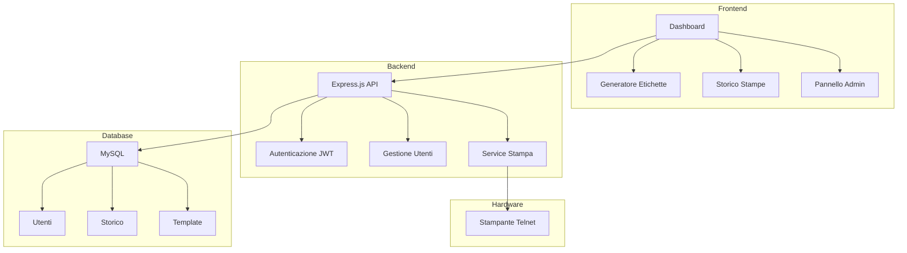

# 🏷️ Sistema Gestione Stampante

[](https://nodejs.org/)
[](https://expressjs.com/)
[](https://mysql.com/)
[](https://docker.com/)
[](LICENSE)

Un'applicazione web moderna per la gestione e stampa di etichette con codici a barre 1D e 2D, sviluppata per ambienti industriali e commerciali.

## 🌟 Caratteristiche Principali

- ✨ **Interfaccia Web Intuitiva** - Dashboard responsive con design moderno
- 🏷️ **Codici 1D e 2D** - Supporto completo per Code 39, QR, DataMatrix, PDF417 e altri
- 👥 **Multi-Utente** - Sistema di autenticazione con ruoli (Operatore/Admin)
- 📊 **Storico Completo** - Tracciamento di tutte le stampe con filtri avanzati
- 🔧 **Template Riutilizzabili** - Salvataggio e condivisione configurazioni etichette
- 🖨️ **Stampa Diretta** - Connessione Telnet per stampanti industriali
- 🐳 **Docker Ready** - Deployment semplificato con Docker Compose

## 🚀 Quick Start

### Prerequisiti

- [Docker](https://www.docker.com/get-started) e Docker Compose
- Stampante compatibile con protocollo Telnet

### Installazione

1. **Clona il repository**
   ```bash
   git clone https://github.com/tuousername/gestione-stampante.git
   cd gestione-stampante
   ```

2. **Configura ambiente**
   ```bash
   # Modifica docker-compose.yaml per impostare l'IP della stampante
   # TN_HOST: 10.2.12.244  # Sostituisci con l'IP della tua stampante
   # TN_PORT: 100           # Porta Telnet della stampante
   ```

3. **Avvia l'applicazione**
   ```bash
   docker-compose up -d
   ```

4. **Accedi all'applicazione**
   - URL: http://localhost:800
   - Admin: `admin` / `admin123`
   - Operatore: `operatore` / `test123`

## 🏗️ Architettura



## 📋 Funzionalità

### 🏷️ Generazione Etichette
- **Codici 1D**: Code 39, Code 128, EAN-13, UPC-A e altri
- **Codici 2D**: QR Code, DataMatrix, PDF417
- **Configurazione Dinamica**: Form generati automaticamente da JSON
- **Anteprima Real-time**: Visualizzazione comando prima della stampa

### 👤 Gestione Utenti
- **Ruoli Multipli**: Operatore e Amministratore
- **Autenticazione Sicura**: Password hashate con bcrypt
- **Session Management**: JWT token con "Remember Me"
- **Controlli Accesso**: Route protette basate su ruoli

### 📊 Storico e Analytics
- **Tracciamento Completo**: Ogni stampa viene registrata
- **Filtri Avanzati**: Per tipo, data, stato, utente
- **Ristampa Rapida**: Ripeti stampe precedenti
- **Export Dati**: Salvataggio template personalizzati

## 🛠️ Tecnologie

### Backend
- **Runtime**: Node.js 18+ con ES Modules
- **Framework**: Express.js 5.x
- **Database**: MySQL 5.7 con supporto JSON
- **Autenticazione**: JWT + bcrypt
- **Comunicazione**: Telnet Client per stampanti

### Frontend
- **Core**: Vanilla JavaScript (ES6+)
- **UI**: CSS3 con variabili custom
- **Icons**: Font Awesome 6
- **Architecture**: SPA con routing client-side

### Infrastructure
- **Containerization**: Docker + Docker Compose
- **Database**: Volumi persistenti
- **Networking**: Container networking isolato

## 📁 Struttura Progetto

```
gestione-stampante/
├── 📁 Frontend/              # Client-side application
│   ├── 📁 home/             # Dashboard principale  
│   ├── 📁 admin/            # Pannello amministratore
│   ├── 📁 history/          # Storico stampe
│   ├── 📁 login/            # Autenticazione
│   ├── 📄 auth.js           # AuthManager globale
│   └── 📄 style.css         # Stili globali
├── 📁 db/                   # Database setup
│   └── 📁 init/             # Script inizializzazione
├── 📄 Router.js             # Server Express principale
├── 📄 commands.json         # Configurazione comandi stampante
├── 📄 docker-compose.yaml   # Container orchestration
├── 📄 dockerfile           # Container build
└── 📄 package.json         # Dependencies Node.js
```

## 🔧 Configurazione

### Variabili d'Ambiente

```env
# Database
DB_HOST=db
DB_USER=app  
DB_PASSWORD=password
DB_NAME=stampante

# Security
TOKEN_SECRET=your-jwt-secret-key

# Printer
TN_HOST=10.2.12.244    # IP stampante
TN_PORT=100            # Porta Telnet

# Application
PORT=800
```

### Configurazione Stampante

Il file `commands.json` contiene la definizione dei comandi supportati:

```json
{
  "type": "Codice QR",
  "command": "B2", 
  "options": [
    {
      "description": "Posizione X",
      "position": "p1",
      "type": "value",
      "max": 832
    }
    // ... altre opzioni
  ]
}
```

## 📖 API Reference

### Autenticazione
- `POST /login` - Login utente
- `POST /api/verify-token` - Verifica token JWT

### Gestione Utenti (Admin)
- `GET /api/users` - Lista utenti
- `POST /api/users` - Crea utente
- `PUT /api/users/:id` - Aggiorna utente  
- `DELETE /api/users/:id` - Elimina utente

### Servizio Stampa
- `POST /print` - Stampa etichetta

### Storico
- `GET /api/history` - Recupera storico (paginato)
- `DELETE /api/history/:id` - Elimina entry

### Template
- `GET /api/templates` - Lista template
- `POST /api/templates` - Crea template
- `GET /api/templates/:id/export` - Esporta template

## 🚀 Deployment

### Sviluppo
```bash
# Installa dipendenze
npm install

# Avvia in modalità sviluppo
npm run dev

# Database locale
docker-compose up db -d
```

### Produzione
```bash
# Build e deploy
docker-compose up -d --build

# Verifica status
docker-compose ps

# Logs
docker-compose logs -f app
```

## 🧪 Testing

### Test Manuali
1. **Login**: Verifica autenticazione con credenziali default
2. **Generazione**: Crea etichetta QR di test
3. **Stampa**: Verifica connessione stampante (IP corretto)
4. **Storico**: Controlla registrazione nella cronologia
5. **Admin**: Testa creazione/modifica utenti

### Health Check
```bash
# Status applicazione
curl http://localhost:800

# Health API (se implementata)
curl http://localhost:800/health
```

## 📚 Documentazione

- 📋 [**Documentazione Completa**](DOCUMENTAZIONE.md) - Guida tecnica dettagliata
- 🗄️ **Schema Database** - Struttura tabelle e relazioni
- 🔌 **API Endpoints** - Riferimento completo API REST
- 🎨 **Frontend Architecture** - Caricamento dinamico componenti

## 🤝 Contribuire

1. **Fork** il repository
2. **Crea** un feature branch (`git checkout -b feature/AmazingFeature`)
3. **Commit** le modifiche (`git commit -m 'Add AmazingFeature'`)
4. **Push** al branch (`git push origin feature/AmazingFeature`)
5. **Apri** una Pull Request

### Coding Standards
- **ESLint** per JavaScript
- **Prettier** per formattazione codice
- **Conventional Commits** per messaggi commit
- **JSDoc** per documentazione funzioni

## 🐛 Bug Report

Se trovi un bug, per favore apri un [issue](https://github.com/tuousername/gestione-stampante/issues) con:

- 📝 **Descrizione** dettagliata del problema
- 🔄 **Steps** per riprodurre il bug
- 💻 **Ambiente** (OS, Browser, versione Docker)
- 📸 **Screenshots** se applicabili

## 🔐 Sicurezza

### Misure Implementate
- ✅ **Password Hashing** con bcrypt (salt rounds: 10)
- ✅ **JWT Tokens** con scadenza configurabile
- ✅ **SQL Injection Protection** con prepared statements
- ✅ **XSS Protection** con HTML escaping
- ✅ **RBAC** (Role-Based Access Control)
- ✅ **Request Logging** per audit trail

### Reporting Vulnerabilità
Per vulnerabilità di sicurezza, invia email a: security@yourcompany.com

## 📊 Performance

### Ottimizzazioni Database
- **Indici** su colonne frequently queried
- **Paginazione** per dataset grandi
- **Connection pooling** per performance

### Frontend
- **Lazy loading** componenti
- **Caching** configurazioni
- **Minimized** bundle size

## 🗺️ Roadmap

### v1.1 - Q1 2025
- [ ] 🌐 **Internazionalizzazione** (i18n)
- [ ] 📱 **Responsive Design** migliorato
- [ ] 📊 **Dashboard Analytics** avanzata
- [ ] 🔄 **Auto-backup** database

### v1.2 - Q2 2025  
- [ ] 🎨 **Theme Switcher** (light/dark mode)
- [ ] 📧 **Notifiche Email** per eventi critici
- [ ] 🔌 **Plugin System** per estensibilità
- [ ] 📈 **Metriche** stampa real-time

### v2.0 - Q3 2025
- [ ] ☁️ **Cloud Deployment** ready
- [ ] 🔗 **Multi-printer** support
- [ ] 🤖 **REST API** pubblica
- [ ] 📦 **Batch Processing** etichette

## 📄 Changelog

### [1.0.0] - 2025-09-17
#### ✨ Added
- Sistema completo gestione stampante
- Autenticazione multi-ruolo
- Generazione dinamica etichette 1D/2D
- Storico stampe con filtri
- Sistema template riutilizzabili
- Deploy Docker completo

#### 🔧 Technical
- Express.js backend con JWT
- MySQL database con JSON support
- Frontend vanilla JavaScript
- Telnet integration per stampanti

## 📞 Supporto

- 📧 **Email**: support@yourcompany.com
- 💬 **Discord**: [Server Community](https://discord.gg/yourserver)
- 📖 **Wiki**: [Documentation Wiki](https://github.com/tuousername/gestione-stampante/wiki)
- 🐛 **Issues**: [GitHub Issues](https://github.com/tuousername/gestione-stampante/issues)

## 📜 Licenza

Questo progetto è rilasciato sotto licenza [ISC](LICENSE).

```
Copyright (c) 2025 Your Company Name

Permission to use, copy, modify, and/or distribute this software for any
purpose with or without fee is hereby granted, provided that the above
copyright notice and this permission notice appear in all copies.
```

---

<div align="center">

**⭐ Se questo progetto ti è utile, lascia una stella su GitHub! ⭐**

Made with ❤️ by [Your Name](https://github.com/yourusername)

[🔝 Torna all'inizio](#-sistema-gestione-stampante)

</div>